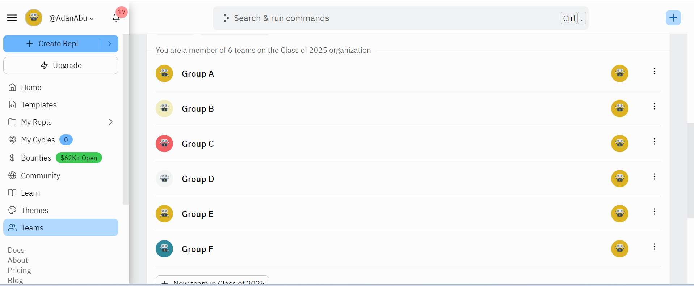
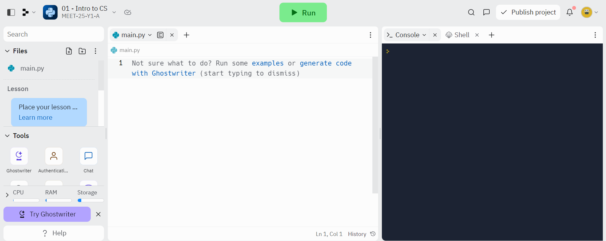

# Intro to CS - Repl.it Lab

## Objective: 
In this lab, you will learn how to us `Repl.it`. These will help you organize your work for this year and for the rest of your journey at MEET!

## Instructions:

1. Make sure you have created a `Repl.it` account with the link provided by your instructors:
    1. If you need help with this, ask a TA or Instructor!

2. Once you've created an account, find the `Teams` tab on the left.
    1. From here you should be able to find your group. Click on it!
    

3. On the group page, you can see all your current labs.
    1. You should see one called `01 - Intro to CS`--click to start the lab.

4. Now you should see the main repl.it page. There are 5 main parts of the page we'll cover:
    - The console
    - The files
    - The editor
    - The run button
    - The submit button
    

Let's take them one by one!

# The Main Repl.it page

1. The console
    - The console is the black box.
    - The console lets you run python code line by line.
    - This is great because you see your output immediately!
    - Try pasting this code into the console and hitting `ENTER` to run it!
        - `print("Hello World!")`
        - Note: Use ctr shift V to paste your code to the console.
        
2. The files
    - The console is great, but it only runs code once.
    - If we want to save our code to run it again, we can put it in a `file`.
    - The files are on the left of the screen. You should see a file called `main.py`.
        - All `python` files end with `.py`
    - Click on `main.py` (it may already be selected).
    
3. The editor
    - The editor is the white box.
    -  The editor lets us write code in our files, then run it again and again.
    - Paste this code into the editor:
        - `print("Hello Y1s!")`
        
4. The run button
    - You can run the code in your `main.py` file by clicking the `Run` button at the top of the screen.
    - Click it, then watch for the result of your code in the console.
    - If you don't see `"Hello Y1s!"`, ask another classmate for help.
        - Check in with a TA or Instructor if you still need help.

<!--
5. The test tab
    - Tests help us make sure our code is working correctly.
    - Click the checkmark on the left of the screen to open the tests tab.
    - Click the `Run tests` button to run tests on your code.
    - If you copied the code exactly from step `3`--it should pass!
        - If the test doesn't pass, ask another classmate for help.
        
       

 -->
        
5. The submit button
    - Once you've followed all the steps in a lab and the test passes, you can click the submit button.
    - Only submit if you are *confident* you have finished your lab--if you have any questions, ask a TA or Instructor!

##### Great job on completing your first Lab!

If you have extra time, continue to the **Bonus Problems** *below*.

## Bonus Problems:

1. Try creating a new file in the file explorer--name it whatever you like, but remember to add `.py` at the end!
    - Now try deleting the new file.

2. Edit your original code so it looks like this: `print("Goodbye! See You Next Session")`
    - Run your code again. It will show an error!
    - What do you think is the problem ? Try fixing it and run your code again!

